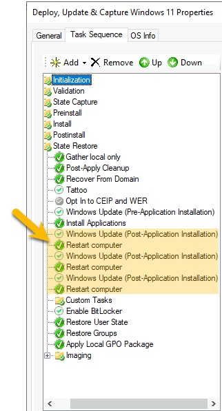

# Configure MDT and Ansible

## Introduction
For Windows 10 or Windows Server 2016/2019/2022, the process is exactly the same. We’re starting this process assuming you already have a sever with MDT installed. In this tutorial the MDT server name is **MDT01** (that exact name is not required). We are going to configure a CAPTURE for Windows 10, with a image file named `W10.wim`. You can change to `W11.wim`, `W19.wim` or `W22.wim` depending on whatever OS you’re capturing.

I have been pretty detailed with my instructions, so don't feel overwhelmed by the number of steps. This whole process will take you less than 30 minutes.

## Step by Step
The steps below once for each operating system you’re capturing. After that, you’ll never need to do this again:

1. Within VMware, create a new Virtual Machine with VMware’s suggested minimum specifications for your Operating System. We will call this machine **WIN10TEMPL**. Take note of the MAC Address associated with this VM. It’s important in subsequent steps.


1. Change the **Disk Mode** of **Hard Disk 1** to type **Independent - Nonpersistent**. This will tell VMware ESXi to automatically reset the hard drive back to its original state each time the machine is powered off.


1. Pull the **install.wim** file from your Windows installation media (or if you have an existing WIM file, you can use that instead). Rename it to `W10.wim`.


1. On **MDT01**, open the Microsoft Deployment Toolkit > Deployment Workbench application. Under **Operating Systems**, click **Import Operating System** > **Custom image file** > **Setup files are not needed**. 

1. Delete all of the additional operating systems that came within W10.wim until you’re left with the only OS you want to capture (e.g. Windows 10 Pro for Workstations). Then, rename the remaining image to `W10.wim` for ease of reference.


1. Under Task Sequences create a New Task Sequence using `CAPTURE_W10` as the **Task Sequence ID** and `Deploy, Update & Capture Windows 10` as the **Task Sequence name** using the **Standard Client Task Sequence** task sequence template. *The remaining options in the wizard are of no consequence to Ansible, so choose whatever options are best suited for your environment. I would suggest you use a standard administrator password, however, for reasons I will outline in a future blog post*.


1. Once the task sequence is created, double-click it and go to the **Task Sequence** tab. 


1. Enable the **State Restore** > **Windows Update (Pre-Application Installation)** step.


1. Enable the **State Restore** > **Windows Update (Post-Application Installation)** step.


1. Underneath **Windows Update (Post-Application Installation)** add a **Restart computer** step.


1. Some Windows Updates have prerequisites that must be installed in a prior reboot. So using right-click and **Copy**, repeat the **Windows Update (Post-Application Installation)** and **Restart computer** steps several times. When you’re done, your Task Sequence should look something like this:

    


1. Click **Apply** and **OK**. Then, right click on **MDT Deployment Share** and select **Properties** > **Rules** (tab).


1. Under `[Settings]` change Priority to what’s below which tells LiteTouch to prioritise rules by MACAddress over the Default rules:
```
Priority=MACAddress, Default
```


1. Now we’re going to create a Rule for the MAC Address associated with **WIN10TEMPL**. Replace `00:00:00:00:00:00` with the VMs real MAC address:
```
[00:00:00:00:00:00]
SkipTaskSequence=YES
TaskSequenceID=CAPTURE_W10
FinishAction=SHUTDOWN
_SMSTSORGNAME=Windows 10 Deploy and Capture
BackupFile=W10.wim
DoCapture=YES
SkipCapture=YES
ComputerBackupLocation=%DeployRoot%\Captures
SkipComputerName=YES
SkipDomainMembership=YES
SkipUserData=YES
SkipLocaleSelection=YES
SkipTimeZone=YES
SkipApplications=YES
SkipBitLocker=YES
SkipSummary=YES
SkipRoles=YES
SkipFinalSummary=YES
```


1. By default MDT wants you to authenticate before you can access the Deployment Share. We don’t want a username/password screen to show for these capture only virtual machines. So, we’re going to define a rule in the Bootstrap.ini using the MAC Address, saying “when this machine connects to MDT, use this default Windows Active Directory account” (e.g. domain\mdt_capture). This account does not need to be a domain administrator - in fact, I don’t recommend you use a Domain Administrator.

    Click Edit Bootstrap.ini and add the following:
    ```
    [Settings]
    Priority=MACAddress,Default

    [Default]
    DeployRoot=\\MDT01\DeploymentShare$

    [00:50:56:97:46:b2]
    SkipBDDWelcome=YES
    UserID=mdt_capture
    UserPassword=A_COMPLICATED_PASSWORD
    UserDomain=YOUR_FQDN
    ```


1. Click **Apply** and **OK**. Then, right-click **MDT Deployment Share** and choose **Update Deployment Share** (use the default settings), which may recreate the LiteTouch ISOs.


!!! note
    The steps above need to be done once for each Golden Image you want to create. The rest of the steps below are only done once, at initial configuration. 

By default, when you launch a machine with the LiteTouch ISO, you need to “Press any key to continue”. Because this is a hand-free process, let’s remove that prompt:

1. Copy the `LiteTouchPE_x64.iso` MDT created (located under folder */path/to/DeploymentShare/Boot/*).


2. In a dedicated folder anywhere on the MDT server, put the `LiteTouchPE_x64.iso` and the following PowerShell Script:
```powershell
# The script is removing the prompt "Press any key to boot from CD/DVD" message, allowing fully unattended OSD
# Example usage: .\Create-Unattended-ISO.ps1 -SourceISOPath "C:\temp\OSD.ISO" -UnattendedISOPath "C:\temp\Unattended.ISO"
##############################
Param (
[Parameter(Mandatory=$true)]
[ValidateScript({Test-Path $_ -PathType Leaf})]
[String]
$SourceISOPath, # Path to the source ISO file; can be relative
[Parameter(Mandatory=$false)]
[String]
$UnattendedISOPath = '.\Unattended.ISO' # Path to the destination ISO file; can be relative

)

# First we make sure that ADK 10 is installed on the local computer and we get its location
$ADKProduct = $null
$ADKProduct = Get-WmiObject -Class Win32_Product | Where {$_.Name -eq "Windows Deployment Tools"}
if ($ADKProduct -ne $null) {
# Now getting the installation folder; we should have a registry key
if (!(Test-Path -Path "HKLM:\Software\WOW6432Node\Microsoft\Windows Kits\Installed Roots")) {
Write-Host -ForegroundColor Yellow "The ADK 10 application has been detected on the current computer, but the installation folder not. Aborting..."
exit
}
else {
# actual installation folder detection
$Props = Get-ItemProperty -Path "HKLM:\Software\WOW6432Node\Microsoft\Windows Kits\Installed Roots"
$ADKPath = $Props.KitsRoot10
Write-Host -ForegroundColor Green "The ADK 10 application has been detected on the current computer."
}
}
else {
Write-Host -ForegroundColor Yellow "The ADK 10 application is not detected as installed on the current computer. Aborting..."
exit
}

# Then we create the parent folder of the output file, if it does not exist
if (!(Test-Path -Path (Split-Path -Path $UnattendedISOPath -Parent))) {
$NewLocation = New-Item -Path (Split-Path -Path $UnattendedISOPath -Parent) -ItemType Directory -Force
Write-Host -ForegroundColor Green "The parent folder of the output ISO file, $($NewLocation.FullName) has been created."
}

# Then we start processing the source ISO file
$SourceISOFullPath = (Get-Item -Path $SourceISOPath).FullName
try {
Mount-DiskImage -ImagePath $SourceISOFullPath
}
catch {
Write-Host -ForegroundColor Yellow 'An error occured while mounting the source ISO file. It may be corrupt. Aborting...'
exit
}
$iSOImage = Get-DiskImage -ImagePath $SourceISOFullPath | Get-Volume
$iSODrive = "$([string]$iSOImage.DriveLetter):"

# Test if we have enough memory on the current Windows drive to perform the operation (twice the size of the IS0)
$ISOItem = Get-Item -Path $SourceISOFullPath
$SystemDrive = Get-WmiObject Win32_LogicalDisk -filter "deviceid=""$env:SystemDrive"""

if (($ISOItem.Length * 2) -le $SystemDrive.FreeSpace) {
Write-Host -ForegroundColor Green "The current system drive appears to have enough free space for the ISO conversion process."
}
else {
Write-Host -ForegroundColor Yellow "The current system drive does not appear to have enough free space for the ISO conversion process. Aborting..."
exit
}

# Process the ISO content using a temporary folder on the local system drive
if (!(Test-Path -Path "$env:TEMP\sourceisotemp" -PathType Container)) {
New-Item -Path "$env:TEMP\sourceisotemp" -ItemType Directory -Force | Out-Null
}
else {
Remove-Item -Path "$env:TEMP\sourceisotemp" -Force -Confirm:$false
New-Item -Path "$env:TEMP\sourceisotemp" -ItemType Directory -Force | Out-Null
}

Write-Host -ForegroundColor Green "Extracting the content of the ISO file."
Get-ChildItem -Path $iSODrive | Copy-Item -Destination "$env:TEMP\sourceisotemp" -Recurse -Container -Force
Write-Host -ForegroundColor Green "The content of the ISO file has been extracted."

# Processing the extracted content
if (Test-Path -Path "$env:TEMP\sourceisotemp\boot\bootfix.bin" -PathType Leaf) {
Remove-Item -Path "$env:TEMP\sourceisotemp\boot\bootfix.bin" -Force -Confirm:$false
}
$oscdimg = $ADKPath + "Assessment and Deployment Kit\Deployment Tools\amd64\Oscdimg\oscdimg.exe"
$etfsboot = $ADKPath + "Assessment and Deployment Kit\Deployment Tools\amd64\Oscdimg\etfsboot.com"
$efisys_noprompt = $ADKPath + "Assessment and Deployment Kit\Deployment Tools\amd64\Oscdimg\efisys_noprompt.bin"
$parameters = "-bootdata:2#p0,e,b""$etfsboot""#pEF,e,b""$efisys_noprompt"" -u1 -udfver102 ""$env:TEMP\sourceisotemp"" ""$UnattendedISOPath"""

$ProcessingResult = Start-Process -FilePath $oscdimg -ArgumentList $parameters -Wait -NoNewWindow -PassThru

if ($ProcessingResult.ExitCode -ne 0) {
Write-Host -ForegroundColor Yellow "There was an error while creating the iso file."
}
else {
Write-Host -ForegroundColor Green "The content of the ISO has been repackaged in the new ISO file."
}

# Cleaning up
Remove-Item -Path "$env:TEMP\sourceisotemp" -Force -Recurse -Confirm:$false
Write-Host -ForegroundColor Green "The temp folder has been removed."

# Dismount the ISO file as we no longer require it
Dismount-DiskImage -ImagePath $SourceISOFullPath
Write-Host -ForegroundColor Green "The source ISO file has been unmounted."
```


1. As an administrator, open a PowerShell window cd to the dedicated folder containing the abovementioned PowerShell script and LiteTouch ISO, and run the following command:
```powershell
.\Create-Unattended-ISO.ps1 -SourceISOPath .\LiteTouchPE_x64.iso -UnattendedISOPath .\LiteTouchPE_x64_NoPrompt.iso
```


1. Upload the outputted `LiteTouchPE_x64_NoPrompt.iso` to vCentre and attach it to the CDROM drive for virtual machine **WIN10TEMPL**.

Now, each time **WIN10TEMPL** boots, LiteTouch will launch and it will automatically initiate the **Deploy, Update & Capture Windows 10** task sequence. Because this is a non-persisted disk, VMware will automatically reset the hard drive back to its original empty state.

Excellent! We’re almost done!

The only step remaining is to create an Ansible Playbook that will power-on the virtual machine, wait MDT to shutdown WIN10TEMPL (once the capture process is complete). Then, Ansible will overwrite the `W10.wim` in the DeploymentShare with the latest capture. That’s it! That’s the magic sauce!

I’ve used variables to make the playbook below reusable for Windows 10/11 and Windows Server 2016/2019/2022 captures. Just set the variables in Ansible Automation Platform:

```yaml
​​---
- hosts: all
  gather_facts: no
  collections:
    - community.vmware

  vars:
    hostname_var: '{{ lookup("env", "VMWARE_HOST") }}'
    username_var: '{{ lookup("env", "VMWARE_USER") }}'
    password_var: '{{ lookup("env", "VMWARE_PASSWORD") }}'
    datacenter_var: "{{ vSphere_Datacentre }}"
    name_var: "{{ vSphere_VM_Name }}"

  tasks:
    - block:
        - name: Check Variable values
          fail:
            msg: One or more of the variabled failed validation
          when: >
            - (mdt_capture_filepath | length == 0) or
              (mdt_capture_filepath == "") or
              (mdt_image_filepath | length == 0) or
              (mdt_image_filepath == "")

      rescue:
        - meta: end_play

    ##    Power on the non-persistant HD (first shutdown so that the HD is wiped)
    - block:
        - name: Power Off/Down template VM (which also wipes the HD)
          vmware_guest_powerstate:
            hostname: "{{ hostname_var }}"
            username: "{{ username_var }}"
            password: "{{ password_var }}"
            name: "{{ name_var }}"
            state: powered-off
          delegate_to: localhost

      rescue:
        - name: Failed to power off {{ name_var }}
          set_stats:
            data:
              ErrorCode: b948b652-8017-4417-bac0-bd1304dca333

        - meta: end_play

    - block:
        - name: Power on the template VM (to auto-start OS installation)
          vmware_guest:
            hostname: "{{ hostname_var }}"
            username: "{{ username_var }}"
            password: "{{ password_var }}"
            datacenter: "{{ datacenter_var }}"
            name: "{{ name_var }}"
            validate_certs: false
            state: poweredon
          delegate_to: localhost

      rescue:
        - name: Failed to power on the virtual machine
          set_stats:
            data:
              ErrorCode: 72bbbb1f-e35b-44b8-befb-5891e59b6aeb

        - meta: end_play

    ##    Wait for Windows to be installed and the WIM to be captured
    - block:
        - name: Wait for the MDT to finish installing Windows and capturing the Image.
          vmware_guest_info:
            hostname: "{{ hostname_var }}"
            username: "{{ username_var }}"
            password: "{{ password_var }}"
            datacenter: "{{ datacenter_var }}"
            name: "{{ name_var }}"
            validate_certs: false
          register: vmpoweredon
          until: vmpoweredon.instance.hw_power_status  == "poweredOff"
          retries: 24
          delay: 600
          delegate_to: localhost

      rescue:
        - name: Timeout - Machine {{ name_var }} did not finish installing and capturing within the expected allowance
          set_stats:
            data:
              ErrorCode: 94a1a942-5eb9-442c-a479-aa64feb9ee25

        - meta: end_play


    ##    Copy the captured WIM into the MDT folder. Then, delete the captured WIM
    - block:
        - name: Copy capture into the MDT folder (overwriting existing image)
          win_copy:
            src: "{{ mdt_capture_filepath }}"
            dest: "{{ mdt_image_filepath }}"
            remote_src: yes
            force: yes
          vars:
            become: yes
            become_method: runas
            become_flags: logon_type=interactive logon_flags=with_profile

        - name: Delete capture from MDT Captures folder
          win_file:
            path: "{{ mdt_capture_filepath }}"
            state: absent
          vars:
            become: yes
            become_method: runas
            become_flags: logon_type=interactive logon_flags=with_profile

      rescue:
        - name: Failed to move/delete captured WIM
          set_stats:
            data:
              ErrorCode: f9b3cf87-6646-4663-a8c3-47282993017a

```

## Summary

Congratulations! You've reached the finish line! You can now create other Task Sequences focused on deployment, just make sure you select the same Operating System.

As a recap of what this playbook does:

1. Ansible will boot **WIN10TEMPL** which will launch LiteTouch (since the `LiteTouchPE_x64_NoPrompt.iso` is mounted to the CDROM drive). 
1. LiteTouch will install Windows, install the latest patches and updates from Microsoft, SysPrep and Capture the machine then shut it down. 
1. When Ansible detects **WIN10TEMPL** is shutdown, it will overwrite the golden image in MDT with the exported Capture so that any other Task Sequences you create in MDT (using the same Operating System) will have a recent image, patched the night before by Ansible.

If you really want to be creative you could edit the playbook to archive MDT captures every 3 months for historical purposes.


## Having problems?

If you want to engage me to help you implement this, please [reach out to me via LinkedIn](https://www.linkedin.com/in/timothy-dilbert/) or the BMT wesbite ([click here](https://www.bmt.ky)).